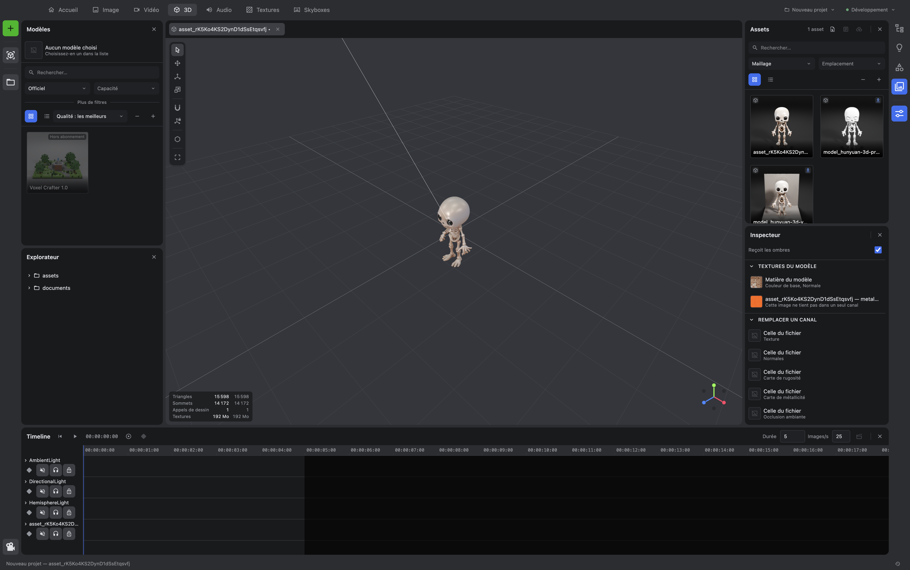

<div align="center">

# IA Studio

**A desktop creation studio for generative models.**
Generate and edit images, videos, 3D models, audio, textures and skyboxes — in one place, on your machine.

[](https://www.electronjs.org)
[](https://react.dev)
[](https://www.typescriptlang.org)
[](https://threejs.org)
[](https://pixijs.com)
[](https://vite.dev)
[](#quality-bar)
[](#license)

**[→ Presentation site](https://pasquelin.github.io/IAStudio/)**

</div>

<div align="center">
  
</div>

---

## Documentation

| | English | Français |
|---|---|---|
| **User guide** — how to use the studio | [docs/en/user-guide.md](docs/en/user-guide.md) | [docs/fr/guide-utilisateur.md](docs/fr/guide-utilisateur.md) |
| **Architecture** — how it is built | [docs/en/architecture.md](docs/en/architecture.md) | [docs/fr/architecture.md](docs/fr/architecture.md) |

The application itself ships in **French and English**; the language follows your settings.

---

## What it is

Not a web client wrapped in a window. A studio: you generate assets, then edit them, combine
them, and assemble them into 3D scenes or video sequences — without leaving the application and
without your API credentials ever reaching the browser context.

The unit of work is a **project**: a folder on your disk. The unit of display is a **workspace**:
seven of them — Image, Video, 3D, Audio, Textures, Skyboxes and Graph — each rearranging the
panels around what that kind of work needs. The Graph is the newest: it holds nodes, wires them,
saves them and runs them, reusing whatever has not changed — its logic and loop nodes are still
to come.

| | |
|---|---|
| **Seven workspaces** | Image, Video, 3D, Audio, Textures, Skyboxes and Graph, each with its own toolbar and its own panels |
| **Real editors, not previews** | a Pixi-backed image canvas, a three.js 3D viewport, a video timeline that decodes for real, and a sound editor working on samples |
| **No hand-written generation forms** | every model's inputs are discovered from the API and rendered from its schema |
| **Your keys stay in the main process** | encrypted by the OS keychain, never handed to the renderer |
| **Bounded concurrency** | one queue polls the API, with exponential backoff on 429 and 5xx |
| **Local catalogue** | assets indexed in SQLite, searched off the UI thread |

---

## Getting started

**Requirements** — Node **24** (the version in `.nvmrc`, which is also what CI runs), [pnpm](https://pnpm.io), macOS / Windows / Linux, and a
API key and secret from your generation provider.

```bash
pnpm install
pnpm rebuild:native   # better-sqlite3 against this Electron build
pnpm start
```

Then open **Settings** (`⌘,` / `Ctrl+,`) and enter your API key and secret. They are encrypted
with the OS keychain and never leave the main process.

Full walkthrough: [user guide](docs/en/user-guide.md) · every setting explained:
[Settings](docs/en/manual/14-settings.md) · how configuration is layered:
[Architecture](docs/en/architecture.md#configuration).

---

## Commands

| Command | What it does |
|---|---|
| `pnpm start` | electron-vite in watch mode, hot reload on main, preload and renderer |
| `pnpm start:debug` | same, with the remote debugging port on 9222 — what drives the app from outside |
| `pnpm build` | typecheck, then build the three targets |
| `pnpm dist` | build, then package and sign with electron-builder |
| `pnpm typecheck` | `tsc --noEmit` across the three targets |
| `pnpm test` · `pnpm test:watch` | vitest, single run or watching |
| `pnpm lint` · `pnpm lint:fix` | eslint over `src` |
| `pnpm format` · `pnpm format:check` | prettier, write or check |
| `pnpm validate` | the gate: every check a commit must pass, chained. `package.json` names its links, and the CI job runs this very command rather than a copy of it |
| `pnpm unused:main` | knip — exports, files and dependencies nothing reaches. **`src/main` only**: the same unreachable export is reported there and ignored under `renderer` and `shared`, and no configuration found so far widens it |
| `pnpm duplication` | jscpd — blocks written twice, from sixty tokens up, over the whole of `src` |
| `pnpm rebuild:native` | electron-rebuild — required after touching better-sqlite3 |

---

## Repository layout

```
src/
├── main/          Electron main process — the only side that holds secrets
│   ├── provider/    API client, model registry, job manager, credentials
│   ├── project/     project folders, manifest, SQLite catalogue
│   ├── settings/    encrypted store and its handlers
│   ├── assets/      asset ingestion and the ia-studio:// protocol
│   ├── media/       ffmpeg-backed media work
│   ├── menu/        native menu, built from the shared registries
│   └── window/      window lifecycle, navigation lockdown
├── preload/       the typed bridge, and nothing else
├── renderer/src/
│   ├── app/         the shell: rails, zones, tool windows, document area
│   ├── design/      the in-house design system — every docked component
│   ├── engines/     one engine per kind of surface. No React in here
│   ├── spaces/      one document editor per kind
│   ├── panels/      the dockable tools
│   ├── stores/      zustand stores
│   ├── hooks/       shared hooks
│   └── helpers/     pure functions
└── shared/        types and constants only — no runtime dependency
    ├── domain/      the vocabulary both processes speak
    └── i18n/        one directory of sections per language, read by the menu and the UI
```

A selection, not an inventory — enough to find your way, and no more.
[Architecture](docs/en/architecture.md#the-main-process) goes through each side in turn.

---

## Quality bar

`pnpm validate` must be green before any commit. It chains every check this repository
enforces — `package.json` is where they are listed, so that no second list can drift from it —
and the suite it runs is **north of 9,000 tests** (9,315 across 686 files on 2026-08-17). Unit
tests are colocated with the code they cover and written in the same movement, never after.

Every change also goes through a reuse-and-simplification pass and an automated review before
it is called done.

---

## Releasing

A `git tag vX.Y.Z` builds and packages the three platforms, and opens a draft GitHub Release.

| | |
|---|---|
| [docs/ci/RELEASE.md](docs/ci/RELEASE.md) | The checklist to publish a version, and how to roll one back |
| [docs/ci/SECRETS.md](docs/ci/SECRETS.md) | Code-signing secrets: what each one is, how to obtain it, when it expires |
| [docs/ci/TROUBLESHOOTING.md](docs/ci/TROUBLESHOOTING.md) | Symptom, cause, fix — for when the pipeline breaks |

The decisions behind the pipeline are recorded in [docs/ci/adr/](docs/ci/adr/). Builds are
currently **unsigned**: macOS and Windows both warn on first launch until the certificates of
`SECRETS.md` are provisioned.

---

## License

Three texts, three scopes:

- **The source code in this repository** is available under the
  [PolyForm Noncommercial License 1.0.0](LICENSE). Read it, build it, study it, use it for any
  noncommercial purpose. Commercial use is reserved.
- **The application** distributed on the releases page has its own [terms of use](EULA.md).
- **The third-party components** both of them carry keep their own licences — 36 of them, in
  [THIRD-PARTY-NOTICES.md](THIRD-PARTY-NOTICES.md) and shown in the app under Help ▸ Licences.

FFmpeg is shipped beside the application as a separate program, under GPL-3.0 on macOS and
LGPL-2.1 elsewhere. Its corresponding sources are attached to every release. The reasoning is in
[ADR-16](docs/ci/adr/ADR-16-licence-du-projet.md).

---

## Independence

This is an **independent project**, developed personally by Alban Pasquelin. Its name, its
icon and its interface are its own, and it reproduces no third party's brand.

The application **provides no generation service and resells none**. It connects to a
generation API using **the key you supply, under your own account**: your use of that
service is governed by its own provider's terms, which you accept directly with them, and
the cost is yours.

© 2026 Alban Pasquelin.
