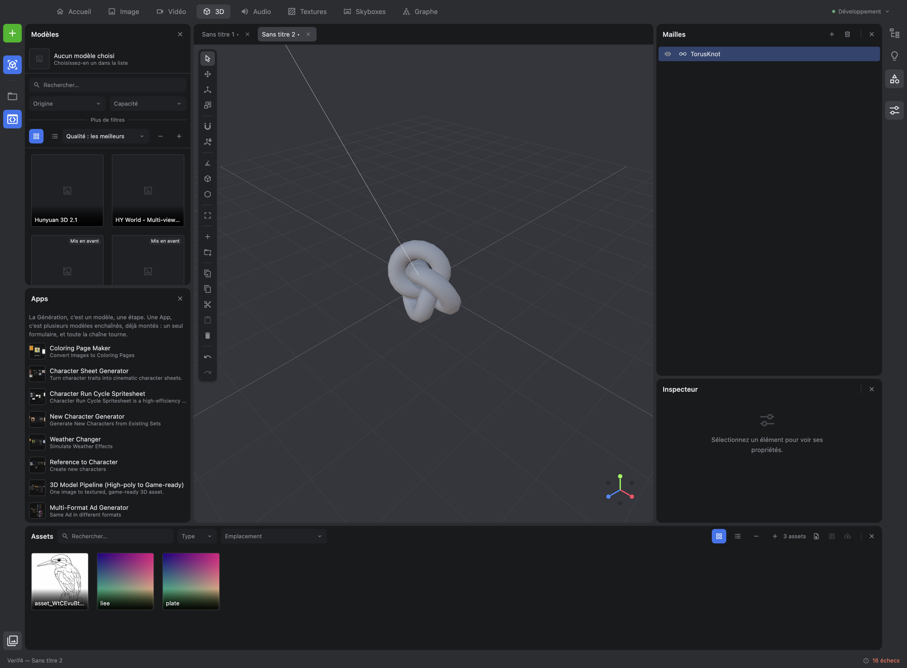

<div align="center">

# Scenario Studio

**A desktop creation studio built on the [Scenario](https://docs.scenario.com) API.**
Generate and edit images, videos, 3D models, audio, textures and skyboxes — in one place, on your machine.

[](https://www.electronjs.org)
[](https://react.dev)
[](https://www.typescriptlang.org)
[](https://threejs.org)
[](https://pixijs.com)
[](https://vite.dev)
[](#quality-bar)
[](#license)

</div>

<!-- SCREENSHOT: the studio in the 3D workspace — rails on both edges, scene viewport in the
     centre, outliner and meshes on the left, models on the right, asset shelf at the bottom.
     Save to docs/images/studio-3d.png (2560×1600, dark theme), then uncomment the block below.
     See docs/images/README.md for the full shot list.

<div align="center">
  
</div>
-->

---

## Documentation

| | English | Français |
|---|---|---|
| **User guide** — how to use the studio | [docs/en/user-guide.md](docs/en/user-guide.md) | [docs/fr/guide-utilisateur.md](docs/fr/guide-utilisateur.md) |
| **Architecture** — how it is built | [docs/en/architecture.md](docs/en/architecture.md) | [docs/fr/architecture.md](docs/fr/architecture.md) |

The application itself ships in **French and English**; the language follows your settings.

---

## What it is

Not a web client wrapped in a window. A studio: you generate assets, then edit them, combine
them, and assemble them into 3D scenes or video sequences — without leaving the application and
without your API credentials ever reaching the browser context.

The unit of work is a **project**: a folder on your disk. The unit of display is a **workspace**:
six of them — Image, Video, 3D, Audio, Textures, Skyboxes — each rearranging the panels around
what that kind of work needs.

| | |
|---|---|
| **Six workspaces** | Image, Video, 3D, Audio, Textures and Skyboxes, each with its own toolbar and its own panels |
| **Three editors** | a Pixi-backed image canvas, a three.js 3D viewport, and a video timeline with real decoding |
| **No hand-written generation forms** | every model's inputs are discovered from the API and rendered from its schema |
| **Your keys stay in the main process** | encrypted by the OS keychain, never handed to the renderer |
| **Bounded concurrency** | one queue polls the API, with exponential backoff on 429 and 5xx |
| **Local catalogue** | assets indexed in SQLite, searched off the UI thread |

---

## Getting started

**Requirements** — Node 22 or later, [pnpm](https://pnpm.io), macOS / Windows / Linux, and a
Scenario API key and secret from [app.scenario.com](https://app.scenario.com).

```bash
pnpm install
pnpm rebuild:native   # better-sqlite3 against this Electron build
pnpm dev
```

Then open **Settings** (`⌘,` / `Ctrl+,`) and enter your API key and secret. They are encrypted
with the OS keychain and never leave the main process.

In development you can drop them in `secrets/.env` instead (`SCENARIO_API_KEY`,
`SCENARIO_API_SECRET`) — read at runtime, never bundled, and always outranked by what you save in
Settings. See [`secrets/README.md`](secrets/README.md).

Full walkthrough: [user guide](docs/en/user-guide.md) · every setting explained:
[Settings](docs/en/user-guide.md#settings) · how configuration is layered:
[Architecture](docs/en/architecture.md#configuration).

---

## Commands

| Command | What it does |
|---|---|
| `pnpm dev` | electron-vite in watch mode, hot reload on main, preload and renderer |
| `pnpm dev:debug` | same, plus the remote debugging port on 9222 |
| `pnpm build` | typecheck, build, and package with electron-builder |
| `pnpm typecheck` | `tsc --noEmit` across the three targets |
| `pnpm test` | vitest, single run |
| `pnpm lint` | eslint over `src` |
| `pnpm format` | prettier, write |
| `pnpm validate` | typecheck + lint + format check + tests |
| `pnpm rebuild:native` | electron-rebuild — required after touching better-sqlite3 |
| `pnpm docs:scenario` | regenerate the local copy of the Scenario API docs |

---

## Repository layout

```
src/
├── main/          Electron main process — the only side that holds secrets
│   ├── scenario/    API client, model registry, job manager, credentials
│   ├── project/     project folders, manifest, SQLite catalogue
│   ├── settings/    encrypted store and its handlers
│   ├── assets/      asset ingestion and the scenario:// protocol
│   ├── media/       ffmpeg-backed media work
│   ├── menu/        native menu, built from the shared registries
│   └── window/      window lifecycle, navigation lockdown
├── preload/       the typed bridge, and nothing else
├── renderer/src/
│   ├── app/         the shell: rails, zones, tool windows, document area
│   ├── design/      the in-house design system — every docked component
│   ├── engines/     canvas, scene and timeline engines. No React in here
│   ├── spaces/      one document editor per kind: image, three, video
│   ├── panels/      the dockable tools
│   ├── stores/      zustand stores
│   ├── hooks/       shared hooks
│   └── helpers/     pure functions
└── shared/        types and constants only — no runtime dependency
    ├── domain/      the vocabulary both processes speak
    └── i18n/        one JSON per language, read by the menu and the UI
```

---

## Quality bar

`pnpm validate` must be green before any commit: typecheck, lint, format check, and the full
test suite — **1087 tests across 124 files** at the time of writing. Unit tests are colocated
with the code they cover and written in the same movement, never after.

Every change also goes through a reuse-and-simplification pass and an automated review before
it is called done.

---

## License

Proprietary. All rights reserved.
